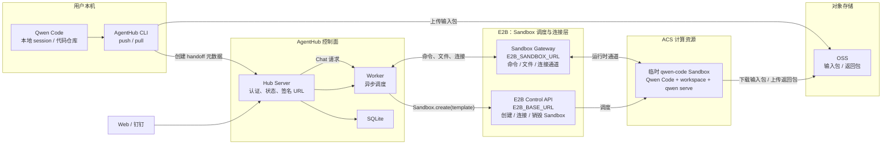
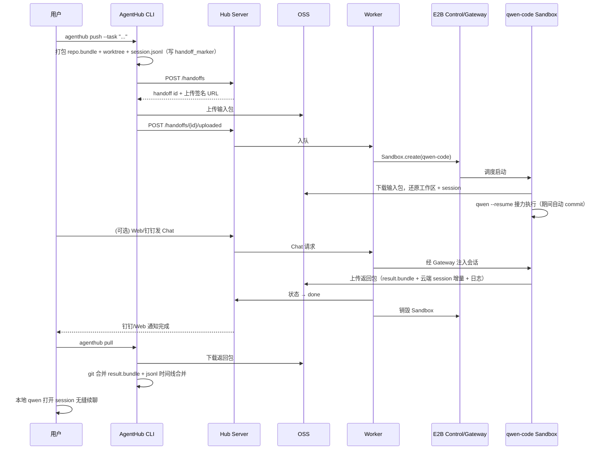

# AgentHub 产品需求文档（PRD）

> 本地 Coding Agent Session 的云端接力平台 —— "Push 出去，Pull 回来，会话不断档"

| 项目 | 内容 |
| --- | --- |
| 产品名称 | AgentHub（队伍产品代号：QwenBots） |
| 版本 | v0.1（Hackathon MVP） |
| 团队 | Team 055（杭州赛区）：俊良、松间客 |
| 文档状态 | Draft |
| 最后更新 | 2026-08 |

---

## 1. 背景与问题

### 1.1 背景

Coding Agent（Claude Code、Qwen Code、Cursor 等）已成为开发者日常工具，但其运行形态存在天然割裂：

- **本地 CLI 形态**：上下文完整（代码 + 会话历史 + 本地环境），但绑定开发者的机器——合上笔记本任务就停了，长任务霸占终端与算力。
- **云端任务形态**（Claude Code cloud tasks、Cursor Cloud Task 等）：可以离开电脑跑任务，但本质是"云端新开一个会话"，以 GitHub 仓库为锚点、以 PR 为交付物：
  1. **上下文断档**：本地聊了半天的 session（需求澄清、方案讨论、踩坑记录）无法带到云端，云端 Agent 是"失忆"的。
  2. **强依赖远程仓库**：必须把代码推到 GitHub/GitLab，对内网项目、未开源代码、临时实验仓库不友好。
  3. **交付物只有代码**：PR 只合并代码 diff，云端会话过程（Agent 的推理与对话记录）无法回到本地继续追问和迭代。

### 1.2 核心问题陈述

> 开发者在本地与 Coding Agent 协作到一半，希望把"**当前会话 + 当前代码状态**"整体移交到云端继续执行，完成后再把"**云端产生的代码变更 + 云端会话记录**"整体拉回本地，无缝续聊——现有产品无法做到。

### 1.3 与竞品的本质差异

| 维度 | Claude Code 云端任务 / Cursor Cloud Task | AgentHub |
| --- | --- | --- |
| 会话起点 | 云端新建会话（无本地上下文） | **本地 session 原样移交**，云端接力续跑 |
| 代码流转 | GitHub 远程仓库（clone / push） | **OSS 上传 repo 快照 + git bundle**，无需远程仓库 |
| 交付方式 | 提 PR，合并进远程分支 | **返回包拉回本地**：git bundle 合并代码 + jsonl 合并会话 |
| 会话记录 | 云端会话留在云端 | **云端 jsonl 与本地 jsonl 合并**，本地可继续追问 |
| 隐私 / 内网 | 代码必须进 GitHub | 代码只经过自有 OSS，适配内网 / 私有项目 |
| 合并复杂度 | git 合并即可 | git 合并 + **会话时间线合并**（非纯代码问题） |

一句话定位：**不是"云端帮你新开一个任务"，而是"把你手上这个任务连人带行李搬到云上继续干，干完原样搬回来"。**

---

## 2. 产品定位与目标

### 2.1 产品定位

面向使用 Qwen Code 的开发者的 **本地 ⇄ 云端 Session 接力（Handoff）平台**。核心能力三件套：

1. **Push（移交）**：一条命令把当前 repo + git bundle + session jsonl 打包上传 OSS，云端 Sandbox 接力执行。
2. **云端接力执行**：E2B Sandbox 内还原工作区与会话，Qwen Code 以既有上下文继续完成任务；支持 Web / 钉钉远程追加指令。
3. **Pull（收回）**：任务完成后把返回包（代码增量 + 云端会话记录）拉回本地，**双向合并**代码与 jsonl 会话，本地无缝续聊。

### 2.2 产品目标（Hackathon 阶段）

| 目标 | 衡量标准 |
| --- | --- |
| G1 跑通端到端接力闭环 | push → 云端执行 → pull → 本地续聊，演示成功率 ≥ 95% |
| G2 会话合并无损 | 合并后本地 session 时间线完整、Qwen Code 可正常加载续聊 |
| G3 移交体验足够轻 | push 命令到云端开始执行 ≤ 60s（中等规模 repo） |
| G4 移动端可管控 | 钉钉 / Web 可查看任务状态、追加一条 Chat 指令 |

### 2.3 非目标（明确不做）

- 不做 GitHub PR 集成、不要求项目存在远程仓库。
- 不做多人协作 / 团队共享 session（MVP 单用户视角）。
- 不做云端长驻开发环境（Sandbox 任务级生命周期，用完即毁）。
- 不做除 Qwen Code 以外的 Agent 适配（架构预留扩展）。

---

## 3. 目标用户与使用场景

### 3.1 目标用户

- **P0 移动性开发者**：通勤 / 下班 / 开会前，本地任务跑到一半必须离开电脑。
- **P0 长任务开发者**：重构、批量迁移、跑测试修 bug 循环等 30min+ 任务，不想让本地机器被占用。
- **P1 内网 / 隐私敏感开发者**：代码不能上 GitHub，但仍想用云端算力跑 Agent。

### 3.2 核心用户故事

**US-1（核心演示场景）**：
> 我在本地用 Qwen Code 讨论并开始一个重构任务，讨论了 20 轮，改到一半要下班。我执行 `agenthub push`，合上电脑走人。路上在钉钉里看到任务进度，回复了一句"顺便把单测也补上"。到家打开电脑执行 `agenthub pull`，代码变更合了进来，聊天记录里能看到云端 Agent 干了什么、为什么这么干，我直接接着问"第 3 个文件为什么这样改？"。

**US-2（并行卸载）**：
> 我让云端接力跑一个耗时的批量修改任务，本地腾出手在同一台机器上开新 session 干别的活，跑完再 pull 回来。

**US-3（内网项目）**：
> 项目没有（也不允许有）GitHub 远程仓库。我照样 push——AgentHub 用 git bundle 走自有 OSS，代码不出可控边界。

---

## 4. 总体架构



### 4.1 组件职责

| 组件 | 职责 |
| --- | --- |
| **AgentHub CLI** | 本地入口：打包 / 解包、与 Hub 交互、OSS 直传直取（签名 URL）、本地代码与会话合并 |
| **Hub Server** | 控制面 API：用户认证、handoff 任务元数据与状态机、OSS 签名 URL 签发、Chat 消息转发 |
| **Worker** | 异步调度：领取待执行 handoff、经 E2B Control API 创建 Sandbox、经 Gateway 下发命令 / 转发 Chat、监控与回收 |
| **SQLite** | 存储用户、handoff 任务、状态流转、Chat 消息记录 |
| **OSS** | 唯一的数据搬运通道：输入包（repo + bundle + session）与返回包（bundle 增量 + 云端 session + 日志） |
| **E2B Control API / Gateway** | Sandbox 生命周期管理与运行时通道（命令执行、文件传输） |
| **qwen-code Sandbox** | 预置 Qwen Code 的临时执行环境：还原工作区 → 恢复 session → `qwen serve` 接力执行 → 打包回传 |
| **Web / 钉钉** | 远程管控面：任务列表、状态、日志摘要、追加 Chat 指令 |

### 4.2 关键数据物件

**输入包（handoff-input）**
```
handoff-<id>-input.tar.gz
├── manifest.json          # handoff 元数据：id、repo 信息、session 信息、基准 commit、任务指令
├── repo.bundle            # git bundle（全量或自 merge-base 起）
├── worktree/              # 工作区快照（含未提交变更 / 未跟踪文件，遵循 .gitignore 白名单策略）
└── session/
    └── <session-id>.jsonl # 本地 Qwen Code 会话记录（截止 push 时刻）
```

**返回包（handoff-output）**
```
handoff-<id>-output.tar.gz
├── manifest.json          # 执行结果：状态、云端 HEAD、耗时、token 用量
├── result.bundle          # 云端产生的 commit 增量（git bundle）
├── session/
│   └── <session-id>.jsonl # 云端接力期间产生的会话增量（带 handoff 标记）
└── logs/                  # 执行日志（结构化，供 Web/钉钉展示与排障）
```

---

## 5. 功能需求

优先级定义：P0 = MVP 必须；P1 = Hackathon 加分项；P2 = 后续规划。

### 5.1 CLI（本地端）

#### F-1 `agenthub push` —— 移交 session 到云端（P0）

- 在 Qwen Code 项目目录下执行，自动识别：当前 git 仓库、当前 / 指定的 Qwen Code session（`~/.qwen/.../chats/*.jsonl` 或项目级 session 目录）。
- 支持参数：`--session <id>`（指定会话）、`--task "<指令>"`（给云端的接力指令，缺省则云端从会话上下文自行续跑）、`--include-untracked`。
- 打包流程：
  1. 生成 `repo.bundle`（首次全量；同仓库再次 push 可增量，P1）。
  2. 快照工作区未提交变更与必要的未跟踪文件。
  3. 拷贝 session jsonl，并在末尾写入一条 `handoff_marker` 记录（时间戳、handoff id、基准 commit），作为后续合并的锚点。
  4. 生成 `manifest.json`。
- 调用 Hub `POST /handoffs` 创建任务 → 获取 OSS 上传签名 URL → 直传输入包 → 通知 Hub 上传完成。
- 输出 handoff id 与 Web 查看链接；命令即刻返回，不阻塞本地终端。
- **验收**：500MB 以内 repo，从执行命令到 Hub 状态变为 `uploaded` ≤ 30s（网络正常情况下）。

#### F-2 `agenthub pull` —— 拉回云端成果并合并（P0）

- `agenthub pull <handoff-id>`（或缺省拉取当前仓库最近一次已完成的 handoff）。
- 流程：
  1. 查询 Hub 任务状态；未完成则提示当前状态并退出（`--wait` 可阻塞等待，P1）。
  2. 通过签名 URL 下载返回包。
  3. **代码合并**：`git fetch <result.bundle>` 后按策略合并到当前分支（见 F-3）。
  4. **会话合并**：将云端 session 增量按时间序合并进本地 jsonl（见 F-4）。
  5. 输出合并摘要：新增 commit 列表、变更文件统计、会话新增轮次。
- **验收**：pull 完成后，本地 `qwen` 打开该 session 可看到完整时间线并正常续聊；`git log` 可见云端 commit。

#### F-3 代码合并策略（P0）

- 云端 Sandbox 内所有变更以 commit 形式落盘（Agent 每完成一个阶段自动 commit），返回 `result.bundle` 只含基准 commit 之后的增量。
- 本地 pull 时：
  - 本地无新提交 → fast-forward。
  - 本地有新提交 → 默认执行 merge，冲突时保留冲突标记并明确提示（不静默覆盖）；`--branch` 参数可改为落到独立分支 `agenthub/<handoff-id>` 由用户自行合并。
- 本地未提交变更存在时，pull 前强制提示（stash 或 commit 后再 pull）。

#### F-4 会话（jsonl）合并策略（P0，本产品核心差异点）

- **数据模型**：session jsonl 为 append-only 消息流，每条记录含时间戳与角色。合并的本质是**两段时间线的拼接与去重**，而非文本 diff。
- **锚点机制**：push 时写入的 `handoff_marker` 是双方共同前缀的末尾。云端 session = 共同前缀 + 云端增量；本地 session = 共同前缀 +（可能存在的）本地增量。
- **合并规则**：
  1. 校验共同前缀一致（按 marker 中的 message hash 链校验，P1 可降级为按条数 + 时间戳校验）。
  2. 本地在 push 后未继续该 session（推荐路径）→ 直接 append 云端增量。
  3. 本地在 push 后继续聊了（分叉场景）→ 按时间戳交错合并，并给每条云端记录打 `source: cloud` 标记；合并处插入一条系统消息说明"以下 N 条来自云端接力"。
  4. 合并前自动备份原 jsonl（`.bak.<timestamp>`），任何失败可一键回滚。
- **验收**：三类场景（无本地增量 / 有本地增量 / 重复 pull 幂等）均正确；重复 pull 不产生重复消息。

#### F-5 `agenthub status / list / cancel`（P1）

- `list`：列出当前仓库 / 当前用户的 handoff 任务及状态。
- `status <id>`：查看单个任务的状态流转与云端执行日志摘要。
- `cancel <id>`：取消排队中或执行中的任务（触发 Sandbox 回收，已产生的部分成果仍打返回包，标记为 `cancelled`）。

#### F-6 `agenthub login`（P0，最简实现）

- MVP 采用预发 token（Hub 配置的静态 API key / 邀请码）完成认证；`~/.agenthub/config` 存储 token 与 Hub 地址。

### 5.2 Hub Server（控制面）

#### F-7 Handoff 任务生命周期管理（P0）

状态机：

```
created → uploaded → queued → provisioning → running
    → packaging → done
    → failed / cancelled / expired（任一执行态可进入）
```

- REST API（示意）：
  - `POST /handoffs`：创建任务，返回 handoff id + 输入包上传签名 URL。
  - `POST /handoffs/{id}/uploaded`：CLI 上传完成回执，任务入队。
  - `GET /handoffs/{id}`：状态、时间线、结果元数据、返回包下载签名 URL（done 后）。
  - `GET /handoffs?repo=...`：任务列表。
  - `POST /handoffs/{id}/cancel`。
  - `POST /handoffs/{id}/chat`：远程追加指令（见 F-11）。
- 所有状态变更落 SQLite 并记录时间戳，供 Web / 钉钉展示时间线。

#### F-8 OSS 签名 URL 服务（P0）

- Hub 持有 OSS 凭证，CLI 与 Sandbox 均不持有长期凭证，只拿到限时（如 30min）、限 key 的签名 URL。
- 输入包与返回包按 `handoffs/<user>/<id>/input.tar.gz|output.tar.gz` 组织，设置生命周期规则自动过期清理（如 7 天）。

#### F-9 认证与隔离（P0 简化版）

- Bearer token 认证；handoff 归属用户，API 层校验归属。
- P2：多租户、配额、审计日志。

### 5.3 Worker（调度执行面）

#### F-10 Sandbox 编排（P0）

- 轮询 / 事件驱动领取 `queued` 任务，执行编排脚本：
  1. `Sandbox.create(template="qwen-code")` —— 模板预装 Qwen Code、git、常用运行时。
  2. Sandbox 内执行 bootstrap：用签名 URL 下载输入包 → `git clone repo.bundle` → 还原 worktree → 放置 session jsonl 至 Qwen Code 会话目录。
  3. 启动 `qwen serve`（或 headless 模式），以 `--resume <session-id>` 恢复会话上下文，注入接力指令（manifest 中的 task，或默认续跑指令）。
  4. 监控执行：通过 Gateway 流式收集日志与关键事件（工具调用、commit 产生），写回 Hub 供前端展示。
  5. 完成 / 超时 / 失败后统一执行 packaging：生成 result.bundle + 云端 session 增量 + 日志 → 上传返回包 → 销毁 Sandbox。
- 硬性保障：
  - 任务超时上限（默认 30min，manifest 可配）到期强制 packaging + 回收，避免 Sandbox 泄漏。
  - Worker 崩溃恢复：重启后扫描 `provisioning/running` 任务，能重连的重连（E2B connect），不能的标记 failed 并尽力回收。

#### F-11 云端会话远程交互（Chat）（P1）

- `running` 状态下，用户在 Web / 钉钉发送消息 → Hub `POST /handoffs/{id}/chat` → Worker 经 Gateway 注入到 Sandbox 内的 `qwen serve` 会话。
- Agent 回复经同一通道回传，落 DB 并推送到前端；这些交互同样写入云端 session jsonl，最终随返回包合并回本地。
- **这是"接力"体验的关键**：云端不是黑盒批处理，而是可继续对话的活会话。

### 5.4 Web / 钉钉（远程管控面）

#### F-12 Web 任务面板（P0 最简版）

- 任务列表：id、仓库、任务摘要、状态、耗时。
- 任务详情：状态时间线、执行日志流（关键事件级）、云端产生的 commit 列表。
- Chat 输入框（配合 F-11，P1）。

#### F-13 钉钉集成（P1）

- 状态变更主动推送（开始执行 / 完成 / 失败）。
- 机器人对话：查询状态、追加 Chat 指令（复用 F-11 通道）。

### 5.5 Sandbox 模板（P0）

#### F-14 qwen-code Sandbox 模板

- 基于 E2B custom template 构建：Qwen Code CLI、git、Node.js / Python 等常用运行时、bootstrap / packaging 脚本。
- 模型访问凭证由 Worker 在创建时以环境变量注入（不打进镜像）。
- Sandbox 无 OSS 长期凭证，仅使用签名 URL。

---

## 6. 关键流程（端到端时序）



---

## 7. 非功能需求

| 类别 | 需求 |
| --- | --- |
| 性能 | push 打包上传（500MB 内 repo）≤ 30s；Sandbox 冷启动到开始执行 ≤ 60s；pull 合并 ≤ 10s |
| 可靠性 | 任何失败路径都有明确终态与错误信息；jsonl 合并前自动备份，可回滚；pull 幂等（重复执行不重复合并） |
| 安全 | 端到端仅使用限时签名 URL；模型 / OSS 长期凭证只存在于控制面；Sandbox 任务级隔离、用完即毁；OSS 对象自动过期 |
| 隐私 | 代码与会话不经过任何第三方代码托管平台；OSS bucket 用户自有 / 平台托管可选 |
| 可观测 | handoff 全生命周期状态时间线；Sandbox 内关键事件日志回传；失败任务日志可查 |
| 成本 | Sandbox 按任务生命周期计费，超时强制回收；OSS 生命周期自动清理 |

---

## 8. 里程碑规划

| 里程碑 | 范围 | 验收 |
| --- | --- | --- |
| **M1 骨架跑通** | CLI push/pull（本地打包解包）+ Hub 最小 API + OSS 直传直取 | 不经 Sandbox，push 后手动构造返回包，pull 能正确合并代码与 jsonl |
| **M2 云端接力** | Worker + E2B 模板 + Sandbox bootstrap/packaging + qwen resume 续跑 | US-1 主链路端到端自动完成 |
| **M3 远程交互** | Web 面板 + Chat 注入 + 钉钉通知/指令 | 手机上追加一条指令并在最终返回包中体现 |
| **M4 打磨演示** | 分叉合并、异常路径、状态展示、Demo 剧本 | 3 分钟演示脚本稳定复现 |

---

## 9. 风险与对策

| 风险 | 影响 | 对策 |
| --- | --- | --- |
| Qwen Code session 恢复行为不可控（`--resume` 在异机环境的兼容性） | 云端接力"失忆"，核心卖点失效 | 提前验证 jsonl 迁移 + resume；必要时在接力首条消息中注入压缩的上下文摘要作为降级方案 |
| jsonl 格式随 Qwen Code 版本变化 | 合并逻辑失效 | 合并器只依赖最小字段集（时间戳/角色/内容），版本号写入 manifest 做兼容检查 |
| 大 repo 打包上传慢 | push 体验差 | git bundle 天然压缩；P1 做同仓库增量 bundle；worktree 快照遵循 ignore 规则 |
| 本地分叉合并（push 后本地继续聊/改代码） | 合并冲突、体验混乱 | 代码走标准 git 冲突流程或独立分支；会话按时间戳交错合并并显式标注来源；push 时提示"建议冻结该 session" |
| Sandbox 泄漏 / 费用失控 | 成本风险 | 硬超时 + Worker 崩溃恢复扫描 + 兜底定时清理任务 |
| 云端凭证安全 | 密钥泄露 | 全链路签名 URL；Sandbox 环境变量注入短期凭证；镜像不含任何 secret |

---

## 10. 未来展望（P2+）

- 多 Agent 适配：Claude Code、Codex CLI 等 session 格式的 handoff 适配器。
- 双向多次接力：云端 ⇄ 本地反复移交，session 成为可流转的"工作单元"。
- 团队协作：handoff 移交给同事而非云端——session 即工作交接物。
- 定时 / 触发式接力：结合 schedule，夜间自动接力跑批量任务。
- 增量输入包与断点续传，支撑超大 monorepo。

---

## 附录 A：术语表

| 术语 | 含义 |
| --- | --- |
| Handoff | 一次"本地 → 云端 → 本地"的完整 session 接力任务 |
| 输入包 | push 时上传 OSS 的 repo + git bundle + session jsonl 归档 |
| 返回包 | 云端执行完成后上传 OSS 的代码增量 + 会话增量 + 日志归档 |
| handoff_marker | push 时写入 session jsonl 的锚点记录，用于合并时定位共同前缀 |
| Session 合并 | 将云端会话增量按时间线拼接回本地 jsonl 的过程（区别于 git 代码合并） |
