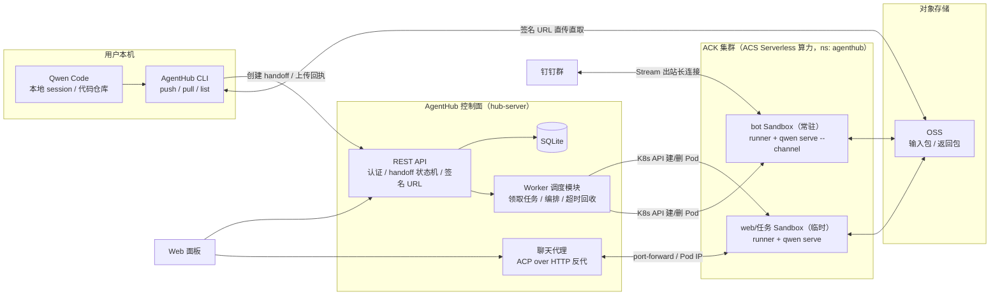
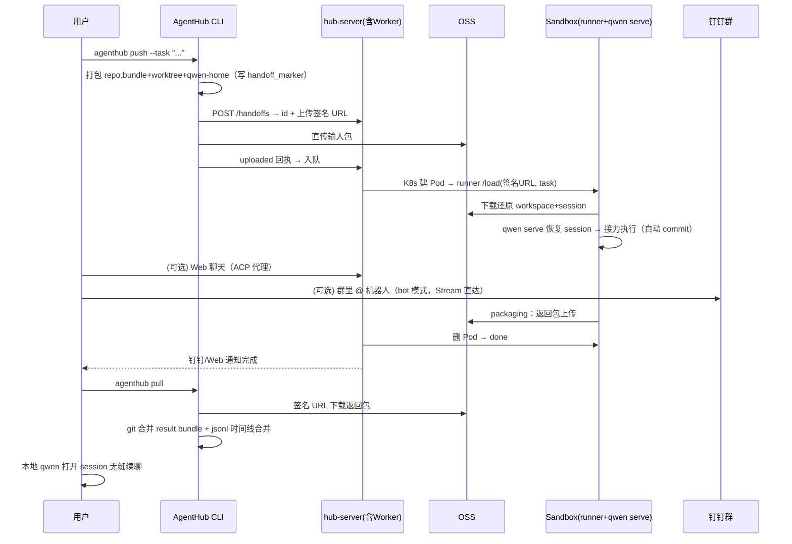

# AgentHub 设计文档（融合版）

> 本地 Coding Agent Session 的云端接力平台 —— "Push 出去，Pull 回来，会话不断档"

| 项目 | 内容 |
| --- | --- |
| 产品名称 | AgentHub（队伍产品代号：QwenBots） |
| 版本 | v0.2（融合俊良 / 松间客两版设计） |
| 团队 | Team 055（杭州赛区）：俊良、松间客 |
| 文档状态 | Draft |
| 最后更新 | 2026-08 |

---

## 1. 背景与问题

### 1.1 背景

Coding Agent（Claude Code、Qwen Code、Cursor 等）已成为开发者日常工具，但其运行形态存在天然割裂：

- **本地 CLI 形态**：上下文完整（代码 + 会话历史 + 本地环境），但绑定开发者的机器——合上笔记本任务就停了，长任务霸占终端与算力。
- **云端任务形态**（Claude Code cloud tasks、Cursor Cloud Task 等）：可以离开电脑跑任务，但本质是"云端新开一个会话"，以 GitHub 仓库为锚点、以 PR 为交付物：
  1. **上下文断档**：本地聊了半天的 session（需求澄清、方案讨论、踩坑记录）无法带到云端，云端 Agent 是"失忆"的。
  2. **强依赖远程仓库**：必须把代码推到 GitHub/GitLab，对内网项目、未开源代码、临时实验仓库不友好。
  3. **交付物只有代码**：PR 只合并代码 diff，云端会话过程（Agent 的推理与对话记录）无法回到本地继续追问和迭代。

### 1.2 核心问题陈述

> 开发者在本地与 Coding Agent 协作到一半，希望把"**当前会话 + 当前代码状态**"整体移交到云端继续执行（既可以自动续跑，也可以随时随地继续对话），完成后再把"**云端产生的代码变更 + 云端会话记录**"整体拉回本地，无缝续聊——现有产品无法做到。

### 1.3 与竞品的本质差异

| 维度 | Claude Code 云端任务 / Cursor Cloud Task | AgentHub |
| --- | --- | --- |
| 会话起点 | 云端新建会话（无本地上下文） | **本地 session 原样移交**，云端接力续跑 |
| 代码流转 | GitHub 远程仓库（clone / push） | **OSS 上传 repo 快照 + git bundle**，无需远程仓库 |
| 云端交互 | 黑盒批处理，最多看日志 | **活会话**：Web 完整聊天 + 钉钉群 @ 机器人对话 |
| 交付方式 | 提 PR，合并进远程分支 | **返回包拉回本地**：git bundle 合并代码 + jsonl 合并会话 |
| 会话记录 | 云端会话留在云端 | **云端 jsonl 与本地 jsonl 合并**，本地可继续追问 |
| 隐私 / 内网 | 代码必须进 GitHub | 代码只经过自有 OSS，适配内网 / 私有项目 |

一句话定位：**不是"云端帮你新开一个任务"，而是"把你手上这个任务连人带行李搬到云上继续干——路上还能随时用手机指挥——干完原样搬回来"。**

---

## 2. 产品定位与目标

### 2.1 两种接力形态（融合点 1）

| | 任务接力（Handoff Task） | 交互接力（Live Session） |
| --- | --- | --- |
| 触发 | `agenthub push --task "<指令>"` | `agenthub push`（不带 task）或任务执行中 |
| 云端行为 | headless 自动续跑，阶段性自动 commit | 挂起等待 / 执行中，用户经 Web 聊天或钉钉群对话 |
| Sandbox | 临时，超时 / 完成即回收 | 临时（web）或常驻（钉钉 bot） |
| 典型场景 | 下班前甩一个重构任务给云端 | 通勤路上手机追问、改需求、开新话题 |

两种形态共用同一套 push/pull 数据链路与 Sandbox 运行时，仅调度策略不同。

### 2.2 MVP 目标

| 目标 | 度量 |
| --- | --- |
| G1 跑通端到端接力闭环 | push → 云端执行 → pull → 本地续聊，演示成功率 ≥ 95% |
| G2 会话合并无损 | 合并后本地 session 时间线完整、Qwen Code 可正常加载续聊 |
| G3 移交体验足够轻 | push 命令到云端开始执行 ≤ 60s（中等规模 repo） |
| G4 移动端可管控 | 钉钉群 @ 机器人可完整对话；Web 可查看状态、日志并聊天 |

### 2.3 非目标（明确不做）

- 不做 GitHub PR 集成、不要求项目存在远程仓库。
- 不做多人协作 / 团队共享 session（MVP 单用户视角；钉钉群多人 @ 同一机器人视为同一用户的多入口）。
- 不做除 Qwen Code 以外的 Agent 适配（架构预留扩展）。

---

## 3. 目标用户与使用场景

- **P0 移动性开发者**：通勤 / 下班 / 开会前，本地任务跑到一半必须离开电脑。
- **P0 长任务开发者**：重构、批量迁移、跑测试修 bug 循环等 30min+ 任务，不想让本地机器被占用。
- **P1 内网 / 隐私敏感开发者**：代码不能上 GitHub，但仍想用云端算力跑 Agent。

**US-1（核心演示场景）**：
> 我在本地用 Qwen Code 讨论并开始一个重构任务，讨论了 20 轮，改到一半要下班。我执行 `agenthub push`，合上电脑走人。路上在钉钉群里 @ 机器人看到任务进度，回复了一句"顺便把单测也补上"。到家打开电脑执行 `agenthub pull`，代码变更合了进来，聊天记录里能看到云端 Agent 干了什么、为什么这么干，我直接接着问"第 3 个文件为什么这样改？"。

**US-2（并行卸载）**：
> 我让云端接力跑一个耗时的批量修改任务，本地腾出手在同一台机器上开新 session 干别的活，跑完再 pull 回来。

**US-3（内网项目）**：
> 项目没有（也不允许有）GitHub 远程仓库。我照样 push——AgentHub 用 git bundle 走自有 OSS，代码不出可控边界。

**US-4（常驻机器人，多群多 session）**：
> 我把一个 agent push 到自己钉钉机器人的常驻 sandbox。项目群 A 里我和同事 @ 它讨论重构（共享一个 session），我自己的小群 B 里 @ 它跑另一个话题（独立 session），互不串扰。

---

## 4. 总体架构



### 4.1 组件职责

| 组件 | 职责 |
| --- | --- |
| **AgentHub CLI** | 本地入口：打包 / 解包、与 Hub 交互、OSS 直传直取（签名 URL）、本地代码与会话合并 |
| **hub-server** | 控制面：认证、handoff 任务状态机、签名 URL 签发、K8s Sandbox 编排（Worker 模块）、聊天代理、静态托管 hub-web |
| **Worker 模块** | hub-server 内异步调度：领取 queued 任务、创建 / 回收 Pod、监控超时、崩溃恢复扫描 |
| **SQLite** | 用户、handoff、快照、bot、状态流转与 Chat 消息记录 |
| **OSS** | 唯一数据搬运通道：输入包与返回包，生命周期自动清理 |
| **Sandbox runner** | Pod 内控制面小服务：下载还原 / 打包上传 / 拉起 qwen serve / 路由绑定 |
| **qwen serve** | 云端 Agent 运行时：ACP over HTTP 会话接口 + channel 托管（钉钉） |
| **hub-web / 钉钉** | 远程管控面：任务面板、日志时间线、聊天；钉钉群完整对话 + 状态推送 |

**关键实现决策（融合点 2）**：Sandbox 编排不引入独立的 E2B 服务层，由 hub-server 的 Worker 模块直接经 `@kubernetes/client-node` 操作 ACK 集群（Pod 调度到 ACS 算力）；对 Pod 的运行时访问收敛到 `SandboxConnector` 抽象——开发期用 K8s port-forward（Hub 本地跑也能通），上云后切直连 Pod IP，切换零改动。E2B 式"Control/Gateway"语义由 Worker + runner 协议共同承担。

### 4.2 关键数据物件：输入包 / 返回包（融合点 3）

包格式融合两版设计：**git bundle 负责代码增量与合并**（松间客版），**qwen-home 目录负责 session 可 resume**（张版）。

**输入包（handoff-input）**
```
handoff-<id>-input.tar.gz
├── manifest.json          # handoff 元数据（见下）
├── repo.bundle            # git bundle（首次全量；同仓库再次 push 增量，P1）
├── worktree/              # 工作区快照（未提交变更 + 必要未跟踪文件，遵循 .gitignore）
└── qwen-home/
    ├── projects/<ws-hash>/chats/<session-id>.jsonl   # 会话记录（末尾写 handoff_marker）
    └── settings.json      # 剔除 apiKey 等密钥后的配置
```

**返回包（handoff-output）**
```
handoff-<id>-output.tar.gz
├── manifest.json          # 执行结果：状态、云端 HEAD、耗时、token 用量
├── result.bundle          # 云端产生的 commit 增量（git bundle）
├── qwen-home/projects/<ws-hash>/chats/   # 云端会话增量（含钉钉各群的多个 session）
└── logs/                  # 结构化执行日志（供 Web / 钉钉展示与排障）
```

**manifest.json 关键字段**：`version`、`handoffId`、`repo`（远程名 / 分支 / 基准 commit）、`workspacePath`（本地绝对路径——云端必须原样重建，见 §7.4）、`wsHash`（getWorkspaceScopeDirName 结果，校验用）、`sessionId`、`task`（接力指令，可空）、`qwenVersion`、`timeoutMinutes`。

OSS key 组织：`handoffs/<user>/<handoff-id>/input.tar.gz|output.tar.gz`，生命周期规则 7 天自动过期。

---

## 5. 功能需求

优先级定义：P0 = MVP 必须；P1 = Hackathon 加分项；P2 = 后续规划。

### 5.1 CLI（本地端）

#### F-1 `agenthub push`（P0）
- 在 Qwen Code 项目目录下执行，自动识别当前 git 仓库与当前 / 指定 session。
- 参数：`--session <id>`、`--task "<指令>"`（缺省即交互接力：云端恢复会话后挂起等待 Web / 钉钉指令）、`--include-untracked`、`--bot <botName> [--chat <chatId>]`（推到常驻钉钉机器人，见 F-13）。
- 打包流程：生成 repo.bundle → 快照 worktree → 拷贝 session jsonl 并写入 `handoff_marker`（时间戳、handoff id、基准 commit）→ 生成 manifest → `POST /handoffs` 拿签名 URL 直传 → 上传回执。
- 命令即刻返回，输出 handoff id 与 Web 链接。**验收**：500MB 内 repo，到 `uploaded` ≤ 30s。

#### F-2 `agenthub pull`（P0）
- `agenthub pull [handoff-id]`（缺省拉当前仓库最近一次已完成任务）。
- 流程：查状态 → 签名 URL 下载返回包 → **代码合并**（F-3）→ **会话合并**（F-4）→ 输出摘要（新增 commit、变更文件、会话新增轮次）。
- **验收**：pull 后本地 `qwen` 打开 session 可见完整时间线并续聊；`git log` 可见云端 commit；重复 pull 幂等。

#### F-3 代码合并策略（P0）
- 云端所有变更以 commit 落盘（Agent 阶段性自动 commit），result.bundle 只含基准 commit 之后的增量。
- 本地无新提交 → fast-forward；有新提交 → 默认 merge（冲突保留标记、明确提示，不静默覆盖）；`--branch` 落到独立分支 `agenthub/<handoff-id>`。
- 本地有未提交变更时 pull 前强制提示（stash 或 commit）。

#### F-4 会话（jsonl）合并策略（P0，核心差异点）
- session jsonl 为 append-only 消息流，合并本质是**两段时间线的拼接与去重**，非文本 diff。
- `handoff_marker` 为双方共同前缀末尾锚点：云端 = 前缀 + 云端增量；本地 = 前缀 +（可能的）本地增量。
- 规则：① 校验共同前缀（条数 + 时间戳，P1 升级 hash 链）；② 本地无增量 → 直接 append；③ 分叉 → 按时间戳交错合并，云端记录打 `source: cloud` 标记并插入系统消息说明；④ 合并前自动备份 `.bak.<ts>` 可回滚。
- 钉钉 bot 多 session 场景：返回包内含多个 jsonl，push 时移交的 session 走合并流程，云端新产生的 session（新群新话题）直接落盘为本地新 session。

#### F-5 `agenthub status / list / cancel`（P1）；F-6 `agenthub login`（P0，预发 token，存 `~/.agenthub/config`）

### 5.2 hub-server（控制面）

#### F-7 Handoff 状态机（P0）
```
created → uploaded → queued → provisioning → running
    → packaging → done
    → failed / cancelled / expired（任一执行态可进入）
```
- 交互接力在 `running` 态可长时间驻留（等待用户对话），超时策略见 F-10。
- 所有状态变更落 SQLite 记录时间戳，供 Web / 钉钉展示时间线。

REST API（示意）：
```
POST /api/auth/login|register                       # F-9
POST /api/handoffs                                  # 创建，返回 id + 上传签名 URL
POST /api/handoffs/{id}/uploaded                    # 上传回执，入队
GET  /api/handoffs/{id}                             # 状态、时间线、done 后含下载签名 URL
GET  /api/handoffs?repo=...                         # 列表
POST /api/handoffs/{id}/cancel
ANY  /api/handoffs/{id}/chat/*                      # 聊天代理（F-11）
GET  /api/bots · POST /api/bots · DELETE /api/bots/{id}     # F-13
GET  /api/bots/{id}/chats · POST /api/bots/{id}/bind        # 群列表 / session 绑定
```

#### F-8 OSS 签名 URL 服务（P0）
Hub 持有 OSS 凭证（复用 RAM 角色 `<YOUR_RAM_ROLE>`），CLI 与 Sandbox 均不持长期凭证，只拿限时（30min）、限 key 的签名 URL。

#### F-9 认证与隔离（P0 简化版）
Bearer token；handoff / bot 归属用户，API 层校验归属。钉钉凭证 DB 内 AES-256-GCM 加密（HUB_SECRET_KEY）。

### 5.3 Worker（调度执行面，hub-server 内置模块）

#### F-10 Sandbox 编排（P0）
- 轮询领取 `queued` 任务：K8s 创建 Pod（镜像预装 Qwen Code + runner）→ 等 runner 健康 → `POST /load` 注入输入包签名 URL → runner 还原并拉起 qwen serve → 状态 `running`。
- 任务接力：runner 经 ACP 注入 manifest.task 作为接力首条指令，Agent 自动续跑并阶段性 commit。
- 完成 / 超时 / 失败 / 取消统一 packaging：runner `POST /snapshot` 上传返回包 → 删 Pod → 终态。
- 硬性保障：任务接力默认 30min 硬超时（manifest 可配）；交互接力按"最后活跃时间 + 空闲 TTL（默认 2h）"回收，回收前钉钉 / Web 通知；Worker 崩溃重启后扫描 `provisioning/running` 任务重连或标记 failed；每 10 分钟兜底清理孤儿 Pod。

#### F-11 云端会话远程交互——Web Chat（P0，融合点 4：从"注入指令"升级为"完整活会话"）
`qwen serve` 原生提供 **ACP over HTTP** 会话接口，hub-server 纯反向代理（注入各 sandbox 的 `Authorization: Bearer <serveToken>`），不自造协议：
- `POST /acp`：ACP JSON-RPC（initialize / session/load / session/prompt），响应 202，结果走 SSE
- `GET /acp`（Accept: text/event-stream）：SSE 事件流，`Acp-Connection-Id` / `Acp-Session-Id` 头，支持 `Last-Event-ID` 断线续传
- `DELETE /acp`：关闭连接

hub-web 实现薄 ACP 客户端：initialize → session/load(pushed sessionId) → session/prompt；事件流渲染 Agent 输出、工具调用、权限请求。所有交互写入云端 jsonl，随返回包合并回本地。

### 5.4 Web / 钉钉（远程管控面）

#### F-12 Web 任务面板（P0，UI 以 dev/devuser 原型 docs/prototype.html 为准）
- 三栏布局：任务列表（状态筛选 / 搜索）· 任务详情（状态时间线 STEPS、执行日志流、commit 列表、Chat 会话）· 右栏信息卡。
- 辅助视图：**Sandbox 调度层**（实例列表、回收与超时策略展示）、**OSS 对象存储**（包对象、签名 URL、安全模型）、**设置**（Hub 连接、钉钉集成、Handoff 默认策略、数据隐私）。
- Pull 指引 Modal：done 后展示 pull 命令与合并预览。

#### F-13 钉钉集成（P1，融合点 5：channel 常驻机器人替代 webhook 单向推送）
每个用户自己申请钉钉机器人（企业内部应用），AgentHub 为其创建**常驻 bot sandbox**：
- runner 生成 settings.json 的 `channels.<botName>` 配置（type=dingtalk，clientId/clientSecret 用 `$ENV` 引用 K8s Secret，`sessionScope=chat_thread`，groupPolicy=open），启动 `qwen serve --workspace <ws> --channel <botName>`。
- 钉钉走 **Stream 模式**（DWClient 出站 WebSocket），sandbox 无需公网入口。
- 状态推送（开始 / 完成 / 失败）由机器人主动消息发送到已绑定的群。
- **多 session 路由（按群隔离）**：`sessionScope=chat_thread` 时 SessionRouter routingKey = `<botName>:<chatId>`——同一群内多人 @ 共享一个 session；同一个人在不同群 @ 走不同 session；新群首次 @ 自动新建 session，零配置。
- **session 绑定**（把 pushed session 接续到指定群）：利用 daemon 懒恢复机制——bot sandbox 必须用 `qwen serve --channel` 启动（daemon worker 以 lazy 模式创建 SessionRouter 并在启动时 `restoreRoutes()` 加载 `~/.qwen/channels/daemon/<ws-hash>/routes.json`）。runner `POST /bind {chatId, sessionId}`：停 serve → 改写 / 新增该群路由条目指向 pushed session → 重启（秒级）→ 该群下一条消息命中路由 → `loadSession` 恢复完整历史；load 失败自动降级新建（内置容错）。
- **chatId 来源**：runner `GET /chats` 合并 routes.json 与 observed-contacts.json 返回已知群列表；Web 机器人管理页选群绑定；CLI `push --bot <name> --chat <chatId>` 显式指定；目标群从未出现过时先在群里 @ 一下机器人即可被学到。

### 5.5 Sandbox 镜像与 runner（P0）

#### F-14 镜像
`node:22-slim` + Qwen Code（固定版本）+ runner + git / ripgrep 等工具。单镜像双模式，`RUNNER_MODE=task|bot` 区分。模型凭证由 Worker 创建 Pod 时以 K8s Secret 环境变量注入，镜像不含任何 secret，Sandbox 只使用签名 URL 访问 OSS。

#### F-15 runner 控制面协议（端口 8080，Hub 经 SandboxConnector 访问，X-Runner-Token 认证）
```
GET  /healthz                    → {ok, mode, serveReady}
POST /load {inputUrl, task?, bindChatId?}   → 下载还原 → 拉起 serve →（任务接力）注入接力指令
POST /snapshot {outputUrl}       → 现场打包上传返回包
GET  /chats                      → bot 模式：已知钉钉群列表
POST /bind {chatId, sessionId}   → bot 模式：改写路由 + 重启 serve
```

---

## 6. 关键流程（端到端时序）



### 6.1 路径一致性约束（易错点）
qwen 的会话存储按 cwd 路径分片（目录名 = sanitizeCwd(绝对路径)：完整路径逐字符把非字母数字替换为 `-`，Windows 先转小写；已对照 qwen 0.21.3 源码 utils/paths.ts 与 ~/.qwen/projects/ 实际目录验证，早期版本描述的 basename+sha256 不准）。**runner 必须在容器内重建与本地完全相同的绝对路径**（如 `/Users/x/proj`，Linux 容器内 mkdir -p 可行），否则 loadSession 找不到历史。manifest 的 `wsHash` 用于还原后自校验。

### 6.2 push --bot 热替换
runner 收到新 `/load`：停 serve → 备份后覆盖 workspace 与 qwen-home → 带 bindChatId 则改写该群路由 → 重启 serve。其他群既有路由保留在 routes.json，重启后懒恢复，各群会话不受影响。

---

## 7. 技术栈与仓库结构

全 TypeScript monorepo（pnpm workspaces）：

```
packages/
  shared/       # AgentPack/manifest 类型、REST DTO、runner 协议、ACP 消息类型、打包/解包/合并库
  cli/          # agenthub CLI（commander + ali-oss + tar + zod）
  hub-server/   # Fastify + better-sqlite3 + @kubernetes/client-node + undici（含 Worker 模块与聊天代理）
  hub-web/      # Vite + React + TanStack Query（按 prototype.html 实现）
  sandbox/      # Dockerfile + runner（Fastify 控制面）
deploy/         # K8s manifests + 镜像构建推送脚本
```

复用云资源：ACK 集群 `agenthub-demo`（杭州，ACS 算力，新建 ns `agenthub`）、OSS bucket `your-agenthub-bucket`、RAM 角色 `<YOUR_RAM_ROLE>`；需新建 ACR 个人版镜像仓库。

---

## 8. 非功能需求

| 类别 | 需求 |
| --- | --- |
| 性能 | push 打包上传（500MB 内 repo）≤ 30s；Sandbox 冷启动到开始执行 ≤ 60s；pull 合并 ≤ 10s |
| 可靠性 | 任何失败路径都有明确终态与错误信息；jsonl 合并前自动备份可回滚；pull 幂等 |
| 安全 | 全链路限时签名 URL；模型 / OSS 长期凭证只在控制面；serve/runner 双 token；Sandbox 任务级隔离用完即毁；OSS 对象自动过期 |
| 隐私 | 代码与会话不经过任何第三方代码托管平台 |
| 可观测 | handoff 全生命周期时间线；Sandbox 关键事件日志回传；失败任务日志可查 |
| 成本 | Sandbox 按生命周期计费，硬超时 + 空闲 TTL + 孤儿清理三重回收；余额有限，演示彩排前不留常驻资源 |

---

## 9. 里程碑规划

| 里程碑 | 范围 | 验收 |
| --- | --- | --- |
| **M1 骨架跑通** | shared 打包/合并库 + CLI push/pull + Hub 最小 API + OSS 直传直取 | 不经 Sandbox，push 后手动构造返回包，pull 正确合并代码与 jsonl |
| **M2 云端接力** | sandbox 镜像 + runner + Worker K8s 编排 + qwen resume 续跑 | US-1 任务接力主链路端到端自动完成 |
| **M3 远程交互** | Web 面板（按原型）+ ACP 聊天代理 + 钉钉常驻机器人（多群多 session + 绑定） | 手机钉钉群 @ 机器人对话并在最终返回包中体现；跨群 session 隔离验证通过 |
| **M4 打磨演示** | 分叉合并、异常路径、状态展示、Demo 剧本 | 3 分钟演示脚本稳定复现 |

---

## 10. 风险与对策

| 风险 | 影响 | 对策 |
| --- | --- | --- |
| `--resume` / loadSession 在异机环境的兼容性 | 云端接力"失忆" | 提前验证 jsonl 迁移 + resume；容器内重建本地绝对路径（§6.1）；降级方案：接力首条消息注入压缩上下文摘要 |
| jsonl 格式随 Qwen Code 版本变化 | 合并逻辑失效 | 合并器只依赖最小字段集（时间戳/角色/内容）；qwenVersion 写入 manifest 做兼容检查 |
| 大 repo 打包上传慢 | push 体验差 | git bundle 天然压缩；P1 同仓库增量 bundle；worktree 遵循 ignore |
| 本地分叉（push 后本地继续聊/改代码） | 合并冲突 | 代码走标准 git 冲突流程或独立分支；会话按时间戳交错合并并标注来源；push 时提示"建议冻结该 session" |
| serve 重启窗口丢钉钉消息 | 绑定瞬间消息丢失 | 绑定操作秒级；P1 让 runner 延迟到会话空闲时重启 |
| Sandbox 泄漏 / 费用失控 | 成本风险 | 硬超时 + 空闲 TTL + Worker 崩溃恢复扫描 + 10 分钟兜底孤儿清理 |
| 云端凭证安全 | 密钥泄露 | 全链路签名 URL；Secret 环境变量注入；镜像与包内不含任何 secret |
| ACS 虚拟节点未就绪 | Pod 调度失败 | 提前在控制台开启并用 nginx Pod 冒烟验证 |

---

## 11. 未来展望（P2+）

- 多 Agent 适配：Claude Code、Codex CLI 等 session 格式的 handoff 适配器。
- 双向多次接力：云端 ⇄ 本地反复移交，session 成为可流转的"工作单元"。
- 团队协作：handoff 移交给同事——session 即工作交接物。
- 定时 / 触发式接力：夜间自动接力跑批量任务。
- 增量输入包与断点续传，支撑超大 monorepo。

---

## 附录 A：术语表

| 术语 | 含义 |
| --- | --- |
| Handoff | 一次"本地 → 云端 → 本地"的完整 session 接力任务 |
| 任务接力 / 交互接力 | 云端 headless 自动续跑 / 云端挂起由用户经 Web·钉钉对话驱动 |
| 输入包 / 返回包 | push 上传 / 云端回传的 tar.gz（repo bundle + worktree + qwen-home 会话） |
| handoff_marker | push 时写入 session jsonl 的锚点记录，合并时定位共同前缀 |
| Session 合并 | 云端会话增量按时间线拼接回本地 jsonl（区别于 git 代码合并） |
| bot sandbox | 绑定用户钉钉机器人的常驻 Pod，qwen serve --channel 托管，多群多 session |
| chat_thread 路由 | SessionRouter 按 `<botName>:<chatId>` 路由：同群共享、跨群隔离 |
| SandboxConnector | Hub 访问 Pod 的网络抽象：开发期 port-forward，上云后直连 Pod IP |

## 附录 B：管理面板架构（S2–S23）

- **迁移机制**：`db.ts` 的 `MIGRATIONS[]` + `PRAGMA user_version` 门控，事务化推进，高版本拒绝运行；新迁移只追加。
- **Sandbox 面板**：`sandboxes` 历史表独立于 `handoffs`（bot pod 一对多、时长按 ready→ended）；
  `Worker` 生命周期写入点唯一咽喉 `safeDeletePod(h, reason)`；启动 `reconcileSandboxes()` 双向对账。
- **OSS 面板**：镜像到 SQLite（`*_size/*_uploaded_at/*_expired` 列），GET 纯 SQL；`?refresh=1` 才真 list 对账；
  `assertOwnedKey` 保证签名不越权；未配置时 `NullOssClient` 降级（启动不崩、面板渲染未配置态）。
- **设置面板**：`user_settings` per-key upsert；webhook 用 `encryptSecret` 落库、响应仅掩码；
  token 轮换靠 `users.token_version`，`requireAuth` 比对 JWT `tv`，无兜底。
- **通知器**：`Notifier` 事件驱动（`handoff_events kind='status'`），游标持久化，at-least-once，
  `Worker.tick()` 第 5 步单点调用，不污染 `setStatus` 纯写路径。
- **CLI 设置消费**：优先级 显式 flag > 本地 config > 服务端 `GET /api/settings` > 缺省；离线回退本地。
- **UI 设计系统**：`design-system/agenthub/MASTER.md`（ui-ux-pro-max 产出）——反 AI 味红线、
  `--n-*` 令牌、等宽数据列、空态一等公民；存量页面已按 t20 迁入。

## 附录 C：S19/S20 接力加速（依赖缓存 + 增量 bundle）

**S19 依赖缓存**：runner snapshot 时若云端 workspace 存在 `node_modules`（<1.5GB），
打 tar 上传 `handoffs/<uid>/deps/<wsHash>.tar.gz` + sidecar（`lockHash` = package.json/lockfile 串联 sha256）；
下次 push 上报本地 `depsLockHash`，Worker 比对 sidecar 匹配才签发缓存 GET URL；
`/load` 与输入包并行下载、还原后解压，免重复安装。lockfile 变化即失效（照旧重装）。

**S20 增量 bundle**：runner snapshot 上传 workspace `--all` 温 bundle + sidecar（head）；
下次 push 时 hub 返回 `prevBase`（同 wsHash 最近 handoff 的 base）+ `warmBundle` 提示，
CLI 校验 `prevBase` 为本地 HEAD 祖先且 ≠ HEAD → 只传 `prevBase..HEAD` 增量；
Pod 集群内下载温全量 + `git fetch` 增量合成还原。`prevBase == HEAD` 或祖先校验失败回退全量。
包压缩换系统 tar：创建优先 zstd、探测降级 gzip；解压自动识别（两侧旧包兼容）。

**验收（2026-08-20）**：

| 项 | 结果 |
|---|---|
| 本地自动化（worktree 隔离） | shared 83 / cli 5 / hub-server 80 / sandbox 10 / hub-web 54 全绿 + 四包 typecheck |
| S19 播种/还原/失效 | 真云：`deps cache uploaded` → 二次 `deps cache restored (node_modules)` → 改 lockfile 后不还原 |
| S20 增量/合成/pull | 真云：`✓ 增量 bundle（base …）`×3；warm+delta 合成 done；`pull --branch` 云端 commit 落独立分支 |
| zstd | 增量包 zstd 真云解压正常；无 zstd 环境单测覆盖降级 |

**语义澄清**：`/api/oss` 面板仅展示 SQL 镜像（input/output），deps/warm 对象不在面板可见范围；
snapshot 阶段日志由 `handlePackaging` 在 snapshot 后补 relay（否则 Pod 回收后不可见）。
