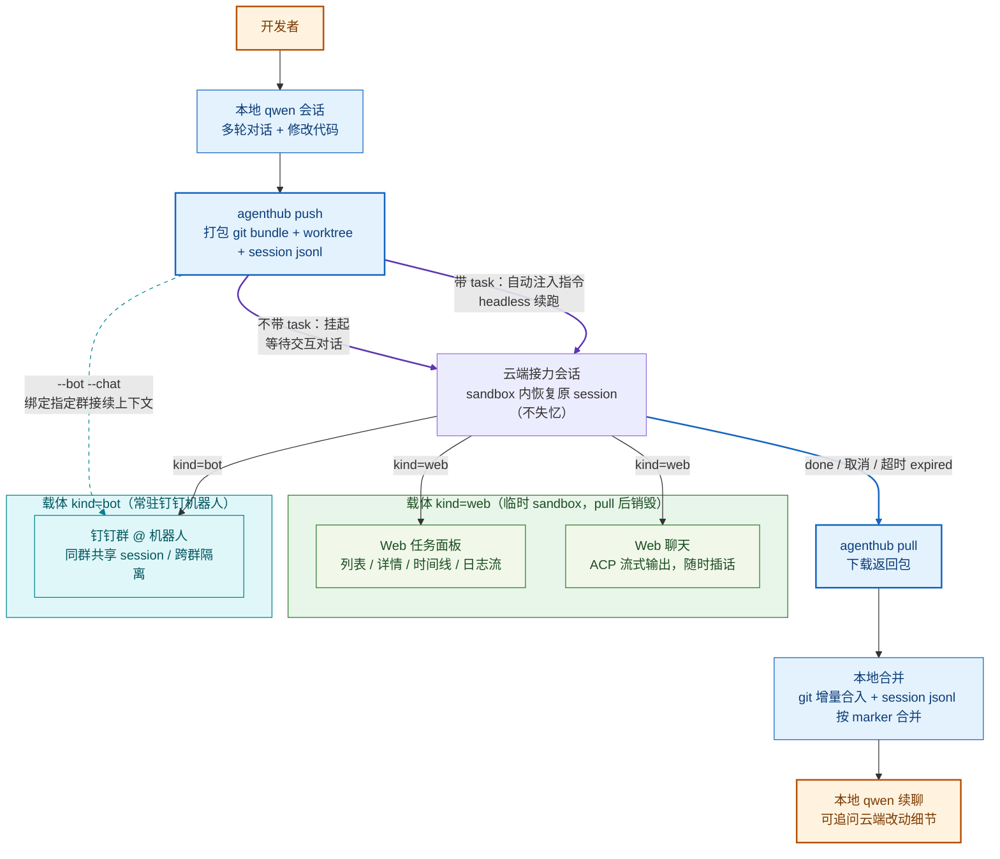

:::
**代码仓库链接**：https://github.com/zijianZhang989/agenthub
:::

# **项目名称**

**AgentHub（队伍产品代号：QwenBots）** —— 本地 Coding Agent Session 的云端接力平台

> 一句话定位：**"Push 出去，Pull 回来，会话不断档"** —— 把你手上这个任务连人带行李搬到云上继续干，路上还能随时用手机指挥，干完原样搬回来。

# **业务设计**

## 1. 选题

开发者在本地与 Coding Agent（Qwen Code）协作到一半，希望把 **"当前会话 + 当前代码状态"整体移交到云端继续执行**（既可以自动续跑，也可以随时随地继续对话），完成后再把 **"云端产生的代码变更 + 云端会话记录"整体拉回本地**，无缝续聊——现有产品无法做到。AgentHub 就是补上这块拼图的平台。

## 2. 项目背景、用户场景与痛点

Coding Agent（Qwen Code、Claude Code、Cursor 等）已成为开发者日常工具，但其运行形态存在天然割裂：

- **本地 CLI 形态**：上下文完整（代码 + 会话历史 + 本地环境），但绑定开发者的机器——合上笔记本任务就停了，长任务霸占终端与算力。
- **云端任务形态**（Claude Code on the web、Cursor Cloud Agents 等）：可以离开电脑跑任务，但本质是"云端新开一个会话"，以 GitHub 仓库为锚点、以 PR 为交付物，存在三个硬伤：
  1. **上下文断档**：本地聊了半天的 session（需求澄清、方案讨论、踩坑记录）无法带到云端，云端 Agent 是"失忆"的，用户只能把背景重新喂一遍，既费时又容易失真；
  2. **强依赖远程仓库**：必须把代码推到 GitHub/GitLab，对内网项目、未开源代码、临时实验仓库不友好；
  3. **交付物只有代码**：PR 只合并代码 diff，云端会话过程（Agent 的推理与对话记录）留在云端，无法回到本地继续追问和迭代。

**核心用户场景**：

| 场景 | 用户故事 |
| --- | --- |
| US-1 移动性交接（核心） | 本地和 Agent 讨论了 20 轮重构，改到一半要下班。`agenthub push` 后合上电脑走人；路上在钉钉群里 @ 机器人看到进度，补一句"顺便把单测也补上"；到家 `agenthub pull`，代码合入，聊天记录里能看到云端 Agent 干了什么、为什么这么干，直接接着问"第 3 个文件为什么这样改？" |
| US-2 长任务并行卸载 | 耗时批量修改任务甩给云端，本地腾出手开新 session 干别的活，跑完再 pull 回来 |
| US-3 内网/隐私项目 | 项目没有（也不允许有）GitHub 远程仓库，照样 push——git bundle 走自有 OSS，代码不出可控边界 |
| US-4 常驻钉钉机器人 | 把 agent push 到常驻 bot sandbox：项目群 A 里多人 @ 它讨论重构（共享 session），自己的小群 B 里 @ 它跑另一个话题（独立 session），互不串扰 |

**解决的核心问题与关键价值点**：

1. **会话即工作单元**：session 不再是绑定机器的易失状态，而是可打包、可流转、可合并的一等公民；
2. **不失忆的云端接力**：云端恢复的是原 session 的完整上下文，而非重新开一个"空白会话"；
3. **不依赖远程仓库的代码流转**：代码经 OSS 签名 URL 直传直取，适配内网/私有项目；
4. **双向合并的完整闭环**：回来的不只是代码 diff，还有云端会话记录，本地可继续追问云端改动细节；
5. **活会话而非黑盒批处理**：云端执行期间可通过 Web 聊天 / 钉钉群 @ 随时插话改需求。

## 3. 解决思路与产品创新点

**产品体验架构**（两种接力载体 × 是否带初始指令，正交组合）：

**四大产品创新点**：

1. **Session Handoff（会话移交）范式**：业界云端 Agent 都是"新起会话"，我们首创"移交会话"——`handoff_marker` 锚点 + jsonl 时间线合并算法，让本地/云端/钉钉多端产生的对话最终无损汇合成一条时间线，重复 pull 幂等、分叉场景按时间戳交错合并并标注来源。
2. **代码与会话双通道往返**：输入包（git bundle + worktree 快照 + qwen-home 会话目录）/ 返回包（commit 增量 bundle + 全部会话 jsonl + 结构化日志），代码走 git 合并、会话走时间线合并，两条通道各自幂等可回滚。
3. **云端是"活会话"**：不是只能看日志的黑盒——Web 面板 ACP 流式聊天可随时插话，钉钉群 @ 机器人可完整对话，所有交互写入云端 jsonl 随返回包合并回本地。
4. **常驻钉钉机器人载体**：`push --bot --chat` 把本地 session 接续到指定钉钉群；按群路由的多 session（同群共享、跨群隔离、新群零配置自动新建），一个 bot 托管多个项目的多个会话。

## 4. 与竞品对比

| 维度 | Claude Code（on the web / 云端任务） | Cursor Cloud Agents | GitHub Copilot coding agent | Devin | **AgentHub（本作品）** |
| --- | --- | --- | --- | --- | --- |
| 会话起点 | 云端新建会话，本地上下文靠复述 | 从 IDE 可派生云端任务，但上下文以云端为准 | 从 Issue 新建，无本地会话概念 | 云端平台新建任务 | **本地 session 原样移交，云端 resume 不失忆** |
| 代码流转锚点 | GitHub 仓库 | GitHub 仓库 | GitHub 仓库（必须） | 平台托管仓库 | **OSS 签名 URL 直传直取，无需任何远程仓库** |
| 云端交互 | 可下达指令，过程近似黑盒 | 可查看/追加指令 | PR 评论交互，异步 | 平台内聊天 | **Web ACP 流式活会话 + 钉钉群 @ 实时对话** |
| 交付方式 | PR | PR | PR | PR / 平台产物 | **返回包 pull 回本地**：git bundle 合并代码 + jsonl 合并会话 |
| 会话记录归宿 | 留在云端 | 留在云端 | 无会话概念 | 留在平台 | **云端会话合并回本地 jsonl，可继续追问云端改动** |
| 隐私 / 内网友好 | 代码必须进 GitHub | 代码必须进 GitHub | 代码必须进 GitHub | 代码进平台 | **代码只经过自有 OSS，适配内网/私有项目** |
| 多入口协同 | Web/移动端下达任务 | Web | GitHub 站内 | 平台站内 | **Web + 钉钉群（按群隔离多 session）+ CLI 三端同源** |

一句话差异：**竞品是"云端帮你新开一个任务"；AgentHub 是"把你手上这个任务连人带行李搬到云上，干完原样搬回来，且路上随时能指挥"。**

## 5. 价值收益（量化）

| 收益项 | 说明 |
| --- | --- |
| 开发者时间 | 长任务（30min+）不再占用本地终端与算力；通勤/会议/下班碎片时间可经手机继续驱动云端会话 |
| 上下文重建成本 → 0 | 竞品路线云端"失忆"需重新喂背景（通常数百至数千 tokens 的重复描述 + 失真风险）；AgentHub 原 session 恢复，重建成本为 0 |
| 覆盖面扩展 | 无远程仓库 / 内网 / 未开源项目首次获得"云端 Agent 算力"能力 |
| 交付完整度 | 返回的不只是 diff，还有"为什么这么改"的完整推理记录，代码评审与知识沉淀效率提升 |

# **demo （现场演示or展示视频）**

**演示剧本（≤3 分钟，对应 US-1 + US-4）**：

1. **本地铺垫**：qwen 本地会话里与 Agent 讨论一个任务（多轮对话 + 部分代码修改，未提交）；
2. **一键移交**：执行 `agenthub push --task "继续完成并补齐单测"`，输出 handoff id 与 Web 链接，命令即刻返回，本地终端不被占用；
3. **云端接力**：Web 面板实时展示状态时间线（created → uploaded → queued → provisioning → running）与执行日志流（工具调用、git commit 等关键事件）——Agent 引用 push 前的讨论结论继续干活（证明不失忆）；
4. **手机插话**：打开 Web 聊天（或钉钉群 @ 机器人）追加一句指令，ACP 流式输出 Agent 响应；
5. **收回合并**：任务 done 后执行 `agenthub pull`——代码增量 fast-forward 合入、云端会话按 marker 合并进本地 jsonl；
6. **无缝续聊**：本地 qwen 打开同一 session，时间线完整（含云端段落），直接追问"第 3 个文件为什么这样改？"，Agent 基于完整上下文作答。

**演示重点呈现**：

- 核心能力：session 不失忆的云端接力 + 代码/会话双向合并闭环；
- 问题解决效果：合并后 jsonl 时间线完整可追溯、重复 pull 幂等、分叉场景有明确来源标注；
- 体验与易用度：全程两条 CLI 命令（push / pull），中间过程 Web/手机可视可干预。

# **技术设计**

## 1. 整体技术架构

**技术架构图**：

```mermaid
flowchart LR
  subgraph LOCAL ["本地环境"]
    QWEN_L["qwen 本地会话<br>+ Git 仓库"]
    CLI["agenthub CLI<br>login / push / pull / list / cancel"]
  end

  subgraph HUB ["hub-server（Fastify）"]
    API["REST /api<br>JWT 认证 / handoff 状态机 / 签名 URL 签发"]
    WORKER["Worker<br>K8s 编排（@kubernetes/client-node）"]
    CHATPROXY["Chat 代理<br>透明反代 sandbox /acp"]
    DB[("SQLite<br>users / handoffs / bots / events")]
  end

  WEBAPP["hub-web 面板<br>React + Vite + ACP 薄客户端"]
  OSS[("阿里云 OSS<br>input.tar.gz / output.tar.gz<br>7 天生命周期")]

  subgraph ACK ["ACK 集群（ACS 算力，ns=agenthub）"]
    subgraph POD ["Sandbox Pod（无 Service/Ingress）"]
      RUNNER["runner :8080（1号进程）<br>/healthz /load /snapshot /bind /logs"]
      SERVE["qwen serve :8081<br>web: ACP over HTTP<br>bot: --channel 钉钉"]
    end
  end

  DINGTALK["钉钉群"]

  QWEN_L --> CLI
  CLI -->|"REST（JWT）"| API
  CLI <-->|"签名 URL 直传直取"| OSS
  WEBAPP -->|"/api + SSE 日志/聊天"| API
  API --> DB
  API -->|"签发 30min 签名 URL"| OSS
  API --> WORKER
  WORKER -->|"K8s API 建/删 Pod"| RUNNER
  WORKER -->|"轮询 /logs 搬运到 handoff_events"| RUNNER
  CHATPROXY -->|"SandboxConnector<br>port-forward / Pod IP :8081"| SERVE
  RUNNER -->|"spawn / stop-start 绑定重启"| SERVE
  RUNNER <-->|"下载输入包 / PUT 返回包"| OSS
  SERVE <-->|"Stream 出站长连接（bot 模式）"| DINGTALK

  style LOCAL fill:#E3F2FD,stroke:#1565C0,color:#0D3C78
  style QWEN_L fill:#EAF4FE,stroke:#1565C0,color:#0D3C78
  style CLI fill:#EAF4FE,stroke:#1565C0,color:#0D3C78,stroke-width:2px
  style HUB fill:#E8F5E9,stroke:#2E7D32,color:#1B4D22
  style API fill:#F1F8E9,stroke:#2E7D32,color:#1B4D22,stroke-width:2px
  style WORKER fill:#F1F8E9,stroke:#2E7D32,color:#1B4D22
  style CHATPROXY fill:#F1F8E9,stroke:#2E7D32,color:#1B4D22
  style DB fill:#FFFDE7,stroke:#9E7C0C,color:#6B5407
  style WEBAPP fill:#FCE4EC,stroke:#AD1457,color:#7A0F3D,stroke-width:2px
  style OSS fill:#FFF3E0,stroke:#B45309,color:#7C3A00,stroke-width:2px
  style ACK fill:#EDE7F6,stroke:#5E35B1,color:#3B1F7A
  style POD fill:#F3EFFB,stroke:#5E35B1,color:#3B1F7A
  RUNNER@{fill:#FFFFFF;stroke:#5E35B1;color:#3B1F7A;stroke-width:2px}
  SERVE@{fill:#FFFFFF;stroke:#5E35B1;color:#3B1F7A;stroke-width:2px;animation:pulse}
  style DINGTALK fill:#E0F7FA,stroke:#00838F,color:#00565E,stroke-width:2px

  linkStyle 1 stroke:#1565C0,stroke-width:2px
  linkStyle 2 stroke:#B45309,stroke-width:2px,stroke-dasharray:5 5
  linkStyle 7 stroke:#5E35B1,stroke-width:2px
  linkStyle 9 stroke:#2E7D32,stroke-width:2px,animation:mermaid-edge-dash 1.5s linear infinite
  linkStyle 11 stroke:#B45309,stroke-dasharray:5 5
  linkStyle 12 stroke:#00838F,stroke-width:2px,animation:mermaid-edge-dash-leader 3s linear infinite
```

**技术栈与工程形态**：TypeScript monorepo（pnpm workspaces，Node 22），五个包以 `shared` 为唯一契约层：

| 包 | 技术选型 | 职责 |
| --- | --- | --- |
| `shared` | zod（schema 即契约） | 全部 DTO/manifest/runner 协议/ACP 消息类型 + 打包/解包/合并库 |
| `cli` | commander + ali-oss + tar | `agenthub login/push/pull/list/status/cancel` |
| `hub-server` | Fastify + better-sqlite3 + @kubernetes/client-node + undici | REST API、handoff 状态机、Worker K8s 编排、Chat 代理、静态托管 hub-web |
| `hub-web` | Vite + React + TanStack Query | 三栏任务面板（列表/详情时间线/日志流）+ ACP 薄客户端聊天 |
| `sandbox` | Dockerfile（node:22-slim + qwen 固定版 + runner） | Pod 内 runner 控制面（Fastify，1 号进程），spawn 管理 `qwen serve` |

**AI 模型与 AI 工程技术**：

- **模型**：Qwen（通义千问）系列代码模型，经 `qwen serve` 提供 Agent 运行时（工具调用、权限请求、流式输出）；模型凭证由控制面经 K8s Secret 按 Pod 注入，镜像不含任何密钥。
- **ACP（Agent Client Protocol）over HTTP**：不自造协议，直接复用 qwen serve 原生的 ACP JSON-RPC 接口（`initialize / session/load / session/prompt` + SSE 事件流，`Acp-Connection-Id` 连接管理、`Last-Event-ID` 断线续传）；hub-server 做纯透明反代（注入 per-sandbox serve token），hub-web 实现薄客户端——协议升级两端零改动。
- **Session 移植技术**：逆向对齐 qwen 的会话存储机制（会话按 `sanitizeCwd(绝对路径)` 分片于 `~/.qwen/projects/`，已对照 qwen 0.21.3 源码验证）——容器内原样重建本地绝对路径 + wsHash 自校验，实现跨机器 `loadSession` 完整恢复历史。
- **钉钉 Channel 托管**：bot 模式以 `qwen serve --channel` + Stream 出站 WebSocket 接入钉钉，无需公网入口；`sessionScope=chat_thread` 按 `<botName>:<chatId>` 路由多 session。

**阿里云 Agent Infra / 云产品使用**：

| 云产品 | 用途 |
| --- | --- |
| **ACK（容器服务 Kubernetes 版）** | Sandbox 编排集群，namespace `agenthub`；Pod 无 Service/Ingress，攻击面最小化 |
| **ACS（容器计算服务 Serverless 算力）** | Sandbox Pod 调度到 ACS 虚拟节点，按任务生命周期秒级计费，用完即毁 |
| **OSS（对象存储）** | 唯一数据搬运通道：输入包/返回包，`handoffs/` 前缀 7 天生命周期自动过期 |
| **RAM** | 控制面持角色凭证，CLI 与 Sandbox 仅拿限时 30min、限 key 的签名 URL |
| **ACR（容器镜像服务）** | sandbox / hub 镜像仓库 |
| **钉钉开放平台** | 企业内部应用机器人，Stream 模式双向对话 |

## 2. 技术创新设计与技术深度

### 2.1 Harness 工程设计：三层控制面 + 双正交维度

- **三层控制面分层**：hub-server（任务状态机 + 编排）→ runner（Pod 内控制面小服务：`/healthz /load /snapshot /bind /chats /logs`，X-Runner-Token 认证）→ `qwen serve`（Agent 运行时）。每层只做自己的事：Worker 不直接碰 Agent，runner 不关心调度，serve 不关心包格式。
- **两个正交维度**：载体 `kind`（web 临时 sandbox / bot 常驻 sandbox）× 是否带 `task`（带 → headless 自动续跑；不带 → 挂起等待对话），四种组合共用同一套数据链路与运行时，仅调度策略不同。
- **SandboxConnector 网络抽象**：Hub 访问 Pod 的能力收敛为一个接口——开发期 `PortForwardConnector`（kubectl port-forward 等价，Hub 本地跑也能打通真集群），上云后切 `DirectConnector`（Pod IP 直连），切换零改动。
- **单镜像双模式**：同一 sandbox 镜像以 `RUNNER_MODE=web|bot` 区分形态；bot 绑定/热替换通过 runner stop/start serve 实现（秒级，Pod 不重建），其他群既有路由懒恢复不受影响。

### 2.2 数据面创新：Session 时间线合并（核心差异点的技术实现）

- **锚点机制**：push 时 CLI 向移交 session jsonl 追加一条 `agenthub_handoff_marker`（handoffId、基准 commit、messageCount）；qwen 加载时忽略未知 type 行，marker 不影响 resume。
- **合并算法**：以 marker 定位共同前缀 → 校验条数一致（不一致拒绝且不动本地文件）→ 本地无增量直接 append；分叉则按时间戳交错合并，云端记录注入 `agenthub_source: cloud` 并插入系统消息说明来源。
- **可靠性**：合并前自动备份 `.bak.<epoch>` 可一键回滚；同一 handoffId 重复合并幂等跳过（已实测验证）。

### 2.3 提升 Agent 效果与 Tokens 效率

| 手段 | 效果 |
| --- | --- |
| 原 session resume 接力 | 省去竞品路线"重新喂背景"的数百~数千 tokens 上下文重建，且消除复述失真 |
| git bundle 增量传输 | 返回包只含基准 commit 之后的 commit 增量，不重复搬运仓库全量 |
| 结构化事件日志（events.jsonl） | Web/钉钉只消费关键事件级日志（tool/git/chat/err），而非倾倒全部 stdout |
| bot 按群路由多 session | 一个常驻 Pod 托管 N 个群 × N 个话题，上下文互不污染，不互相挤占上下文窗口 |
| 阶段性自动 commit + snapshot 兜底 auto-commit | 云端产出以 commit 形式固化，Agent 中途失败也不丢成果 |

### 2.4 多租场景下的安全、性能与成本

- **安全纵深**：全链路限时签名 URL（CLI/Sandbox 均不持长期凭证）；per-sandbox 双 token（runner token + serve token）；bot 凭证 DB 内 AES-256-GCM 加密；handoff/bot 归属校验（实测跨用户访问 403）；Pod 无 Service/Ingress，钉钉走出站连接；镜像与传输包内均不含 secret。
- **成本三重回收**：任务接力 30min 硬超时 + 交互接力空闲 TTL（默认 2h，按 last_active_at）+ Worker 每 10 分钟兜底清理孤儿 Pod；OSS 对象 7 天自动过期。ACS Serverless 算力按 Pod 存活秒级计费，任务结束立即销毁。
- **可靠性**：handoff 七态状态机全落库成时间线；Worker 崩溃重启后扫描 provisioning/running 任务重连或标记 failed；任何失败路径有明确终态与可读错误信息；pull 幂等。

## 3. 量化指标

| 指标 | 结果 | 备注 |
| --- | --- | --- |
| 工程规模 | 5 个包，约 4,900 行源码 + 约 1,850 行测试代码，45+ commits | Hackathon 6 天周期，双人协作 |
| 测试覆盖 | shared 包（打包/合并/契约）单测覆盖率达标（≥80% 行覆盖为验收线）；合并器四类场景（无分叉/分叉/幂等/前缀冲突）全用例覆盖 | vitest |
| CP-1（M1）验收 | 真 CLI + 真 Hub + 真 OSS 全链路通过：状态时间线完整落库、代码 fast-forward 合入、会话 +2 条正确合并、重复 pull 幂等（HEAD 与 jsonl md5 前后一致）、跨用户访问 403 | 2026-08-04 实测记录 |
| 端到端云端验证 | push → ACK/ACS 建 Pod → runner /load → qwen serve 恢复 session → ACP 流式交互 → snapshot 打包回传，全链路 e2e 通过 | 含 cross-stack e2e（hub-server × 真 runner 子进程） |
| 性能目标（验收基线） | push 打包上传 ≤ 30s（500MB 内 repo）；Sandbox 冷启动 ≤ 60s；pull 合并 ≤ 10s | 真实中型仓库计时取中位数 |
| 成本 | 演示结束后 ns=agenthub 除保留 bot 外无残留 Pod；OSS 临时对象均有过期规则 | 实测核对 |

# **总结展望**

## 1. 总结

**业务价值**：AgentHub 把 Coding Agent 的 session 从"绑定机器的易失状态"升级为"可流转、可合并的工作单元"，首创 **Session Handoff（会话移交）范式**——本地 ⇄ 云端 ⇄ 钉钉三端同源接力，代码与会话双通道无损往返，让开发者"合上电脑任务不断档，拿起手机随时指挥，回到工位无缝续聊"。

**技术创新点**：

1. `handoff_marker` 锚点 + jsonl 时间线合并算法（幂等、可回滚、分叉标注来源）；
2. 容器内原样重建工作区路径实现跨机器 session 无损 resume（对照 qwen 源码逆向验证）；
3. ACP over HTTP 透明代理的"活会话"远程交互，不自造协议；
4. 三层控制面 Harness（hub-server / runner / qwen serve）+ SandboxConnector 抽象 + 单镜像双模式；
5. 全链路签名 URL + per-sandbox 双 token 的安全模型，与 ACS Serverless + 三重回收的成本模型。

## 2. 未来规划演进

- **多 Agent 适配**：Claude Code、Codex CLI 等 session 格式的 handoff 适配器，成为通用的"Agent 会话流转层"；
- **双向多次接力**：云端 ⇄ 本地反复移交，session 成为可持续流转的工作单元；
- **团队协作**：handoff 移交给同事而非云端——session 即工作交接物；
- **定时/触发式接力**：结合定时任务，夜间自动接力跑批量重构、依赖升级、测试修复循环；
- **规模化**：增量输入包与断点续传支撑超大 monorepo；SQLite → 分布式存储，Worker 横向扩展，支撑多租户配额与审计。

# **成员分工：**

| **姓名（花名）** | **主要负责内容** |
|----------------------|----------------------|
| 俊良（队长） | 控制面 / 云端侧 / 钉钉：hub-server（REST + 状态机 + Worker K8s 编排 + Chat 代理 + bots API）、sandbox 镜像与 runner、deploy 部署链路、钉钉常驻机器人（多群路由 / session 绑定） |
| 松间客 | 数据面 / 本地侧 / 前端：shared 契约层（zod schema + 打包/解包/合并库）、agenthub CLI（push/pull/合并）、hub-web 任务面板与 ACP 聊天客户端、端到端验收 |
